# nexplan7 — QalqonAI keyingi qadamlar rejasi

**Sana:** 2026-06-15  
**Maqsad:** Loyihaning hozirgi holatini aniq qilish, BOSQICH 5–6 yakunlanganini tasdiqlash va yangi **BOSQICH 7 (Notification)** ni rejalashtirish.  
**Eslatma:** Ushbu hujjat faqat reja — kod o'zgartirishlari alohida taskda bajariladi.

---

## 1. Qisqa xulosa

**Ha — BOSQICH 5 (Advokat tizimi) va BOSQICH 6 (Lawyer chat REST) backend tomonda yakunlangan.**

Keyingi ustuvor ish: **BOSQICH 7 — Notification** (FCM push + lawyer chat xabarlari + admin onboarding eventlari).

Bir necha kun oldingi tahlil (Case system MVP, BOSQICH 4–10 izlari yo'q) **eskirgan**. Repo arxitekturasi o'zgargan — quyida batafsil.

---

## 2. Eski tahlil vs hozirgi holat

| Mavzu | Eski tahlil (eskirgan) | Hozirgi haqiqat (repo) |
|-------|------------------------|-------------------------|
| BOSQICH 3 | Case system MVP — `CaseEntity`, `CaseController` | **Case butunlay olib tashlangan.** O'rniga AI chat va Lawyer chat **izolyatsiya qilingan** modellar. Hujjat: `AI_Lawyer_Chat_Isolation_Refactor.md` |
| Chat joylashuvi | "Case ichida chat" — caseId root | **Mustaqil:** `AiChat` + `LawyerChat` (AI tarixi advokatga hech qachon o'tmaydi) |
| BOSQICH 4 | "Izlar topilmadi" | **Gemini integratsiya qilingan:** `GeminiAiProviderImpl`, `chatAi.http`, `gemini.http` |
| BOSQICH 5–6 | Rejada bor, kod yo'q deb o'ylangan | **To'liq implementatsiya:** onboarding, katalog, lawyer chat, HTTP testlar, unit testlar |
| Maven coordinates | `api.giybat.uz` | **`api.ailawyer.uz`** — `pom.xml` yangilangan |
| Notification | Kelajakda | **Hook bor:** `NotificationService` faqat `log.info` — haqiqiy FCM yo'q |

### Arxitektura o'zgarishi (muhim)

```
ESKI MODEL (bekor qilindi):
  User → Case yaratadi → Case ichida AI chat / Lawyer chat

HOZIRGI MODEL:
  User → AI chat (alohida)     — /api/v1/ai-chats
  User → Lawyer chat (alohida) — /api/v1/lawyer-chats
  Advokat → onboarding → admin tasdiqlash → public katalog
```

**Case system qayta tiklanmaydi** — hozirgi model product qarori bo'yicha qabul qilingan. Kelajakda "yuridik ish" kontseptsiyasi kerak bo'lsa, alohida muhokama qilinadi.

---

## 3. Eski 10-bosqich vs yangi 11-bosqich xaritasi

### Eski reja (siz bergan 10 bosqich)

| # | Eski nom |
|---|----------|
| 1 | Project foundation |
| 2 | User CRUD |
| 3 | Case system |
| 4 | AI chat + Gemini |
| 5 | Lawyer system |
| 6 | Lawyer chat (REST) |
| 7 | RAG integration |
| 8 | WebSocket |
| 9 | Document analysis |
| 10 | Deployment |

### Yangi reja (hozirgi repo + Notification qo'shilgan)

| # | Yangi nom | Holat | Izoh |
|---|-----------|-------|------|
| 1 | Project foundation | Tugallangan | ApiResponse, GlobalExceptionHandler, application.properties |
| 2 | Auth + User + Profile | Tugallangan | JWT, RBAC, registration, login, profile |
| 3 | Chat izolyatsiya (AI + Lawyer) | Tugallangan | Case o'rniga — `AiChat`, `LawyerChat` entitylari |
| 4 | AI chat + Gemini (FAZA 1) | Tugallangan | `GeminiAiProviderImpl`, escalation, system prompt |
| 5 | Lawyer system | Tugallangan | Onboarding DRAFT→PENDING→APPROVED, katalog, admin |
| 6 | Lawyer chat (REST) | Tugallangan | Start, send, list, close, DTO boyitish, testlar |
| **7** | **Notification (YANGI)** | **Keyingi** | FCM + chat + admin events |
| 8 | RAG (FAZA 2) | Reja | pgvector, qonunlar bazasi, manbali javoblar |
| 9 | WebSocket | Reja | Real-time upgrade (REST + push dan keyin) |
| 10 | Hujjatlar moduli | Reja | 5-tab navigatsiyadagi "Hujjatlar" |
| 11 | Deployment | Reja | dev/stage/prod, CI/CD, monitoring |

```mermaid
flowchart LR
    B1[BOSQICH_1_Foundation]
    B2[BOSQICH_2_Auth_User]
    B3[BOSQICH_3_Chat_Izolyatsiya]
    B4[BOSQICH_4_Gemini_AI]
    B5[BOSQICH_5_Lawyer_System]
    B6[BOSQICH_6_Lawyer_Chat_REST]
    B7[BOSQICH_7_Notification]
    B8[BOSQICH_8_RAG]
    B9[BOSQICH_9_WebSocket]
    B10[BOSQICH_10_Hujjatlar]
    B11[BOSQICH_11_Deployment]

    B1 --> B2 --> B3 --> B4 --> B5 --> B6 --> B7
    B7 --> B8 --> B9 --> B10 --> B11
```



### Tugallangan bosqichlar — asosiy fayllar

| Bosqich | Asosiy fayllar / testlar |
|---------|---------------------------|
| 1–2 | `ApiResponse`, `GlobalExceptionHandler`, `AuthController`, `ProfileController`, `auth.http` |
| 3 | `AiChatEntity`, `LawyerChatEntity`, `AI_Lawyer_Chat_Isolation_Refactor.md` |
| 4 | `GeminiAiProviderImpl`, `AiMessageService`, `chatAi.http`, `gemini.http` |
| 5 | `LawyerProfileService`, `LawyerController`, `LawyerAdminController`, `lawyer.http` |
| 6 | `LawyerChatService`, `LawyerMessageService`, `lawyer-chat.http`, unit testlar |

### Hali yo'q (repo tekshiruvi)

- Haqiqiy FCM push (`NotificationService` — faqat log)
- RAG, pgvector, embedding
- WebSocket / STOMP
- Hujjatlar (document analysis) moduli
- Production deployment pipeline

---

## 4. BOSQICH 7 — Notification (batafsil reja)

### 4.1 Tanlangan qamrov

**O'rta qamrov (kelishilgan):**

- FCM push notification (Android + iOS)
- Lawyer chat — yangi xabar kelganda push
- Admin onboarding eventlari — PENDING / APPROVED / REJECTED

**Hozircha qo'shilmaydi:**

- In-app bildirishnomalar tarixi (DB + REST API) — keyingi iteratsiya
- AI chat javoblari uchun push (alohida product qarori kerak)
- Email duplicate (`EmailSendingService` allaqachon mavjud — push alohida kanal)

### 4.2 Nima uchun hozir?

1. Lawyer chat ishlayapti, lekin advokat yangi xabarni **bilmasdan** qoladi.
2. Admin onboarding arizalarini faqat API orqali ko'radi — push yo'q.
3. Integratsiya nuqtasi tayyor — `LawyerMessageService` allaqachon chaqiradi:

```java
notificationService.notifyNewMessage("Sizda yangi xabar", "Mijozdan yangi xabar keldi", Map.of("chatId", chat.getId().toString()));
```

### 4.3 Maqsad

Foydalanuvchi, advokat va admin **mobil qurilmada** muhim hodisalar haqida darhol xabar olishi.

### 4.4 Bildirishnoma turlari (MVP)

| `NotificationType` | Kimga | Qachon trigger | Payload (misol) |
|--------------------|-------|----------------|-----------------|
| `LAWYER_NEW_MESSAGE` | Advokat | Mijoz chatga yozganda | `{ "type": "LAWYER_NEW_MESSAGE", "chatId": "uuid", "lawyerId": 5 }` |
| `CLIENT_NEW_MESSAGE` | Mijoz | Advokat javob berganda | `{ "type": "CLIENT_NEW_MESSAGE", "chatId": "uuid", "clientId": 9 }` |
| `LAWYER_ONBOARDING_PENDING` | Admin(lar) | Advokat submit qilganda | `{ "type": "LAWYER_ONBOARDING_PENDING", "profileId": 7 }` |
| `LAWYER_ONBOARDING_APPROVED` | Advokat | Admin tasdiqlaganda | `{ "type": "LAWYER_ONBOARDING_APPROVED", "profileId": 7 }` |
| `LAWYER_ONBOARDING_REJECTED` | Advokat | Admin rad etganda | `{ "type": "LAWYER_ONBOARDING_REJECTED", "profileId": 7, "reason": "..." }` |

### 4.5 Texnik komponentlar

#### A) Firebase / FCM (infra)

- [ ] Firebase Console da loyiha yaratish (Android + iOS)
- [ ] Service account JSON (backend uchun)
- [ ] Mobil: `google-services.json` (Android), APNs key (iOS) — **mobil jamoa**
- [ ] Backend: `firebase-admin` SDK
- [ ] Konfig: `firebase.enabled=true/false`, `firebase.credentials.path` yoki `GOOGLE_APPLICATION_CREDENTIALS`
- [ ] Dev rejim: FCM o'chirilgan bo'lsa — log fallback (hozirgi kabi, exception yo'q)

#### B) Device token saqlash (DB)

Yangi jadval — `device_token`:

| Maydon | Turi | Vazifa |
|--------|------|--------|
| `id` | UUID / Integer | PK |
| `profile_id` | Integer | Qaysi foydalanuvchi |
| `token` | String | FCM device token |
| `platform` | Enum | ANDROID / IOS |
| `active` | Boolean | Logout yoki eskirgan token |
| `created_date` | DateTime | Birinchi ro'yxat |
| `last_used_date` | DateTime | Oxirgi muvaffaqiyatli yuborish |

Qoidalar:

- Bir foydalanuvchi — bir nechta qurilma (telefon + planshet)
- Logout → `active = false`
- Token yangilanganda eski token deactivate

Yangi API:

| Method | URL | Vazifa |
|--------|-----|--------|
| POST | `/api/v1/notifications/device-token` | Login dan keyin token ro'yxatdan o'tkazish |
| DELETE | `/api/v1/notifications/device-token` | Logout — token o'chirish |

#### C) NotificationService kengaytirish

Hozirgi holat: `notifyNewMessage(title, body, payload)` → `log.info` only.

Rejalashtirilgan:

- `NotificationType` enum (yuqoridagi 5 ta)
- `FcmNotificationSender` — Firebase Admin orqali yuborish
- `NotificationDispatcher` — profileId bo'yicha device token larni topish va yuborish
- Admin eventlari: `ROLE_ADMIN` + `ROLE_SUPERADMIN` egalariga broadcast

#### D) Integratsiya nuqtalari (mavjud kod)

| Fayl | Metod | Qo'shiladigan event |
|------|-------|---------------------|
| `LawyerMessageService` | `startChatAndSend` | `LAWYER_NEW_MESSAGE` → advokatga |
| `LawyerMessageService` | `sendMessage` | USER yozsa → `LAWYER_NEW_MESSAGE`; LAWYER yozsa → `CLIENT_NEW_MESSAGE` |
| `LawyerProfileService` | `submitOnboarding` | `LAWYER_ONBOARDING_PENDING` → adminlarga |
| `LawyerProfileService` | `approve` | `LAWYER_ONBOARDING_APPROVED` → advokatga |
| `LawyerProfileService` | `reject` | `LAWYER_ONBOARDING_REJECTED` → advokatga |

#### E) `unreadCount` (LawyerChatDTO)

Hozir doim `0` qaytariladi.

- **Birinchi iteratsiya (tavsiya):** Variant A — `0` qoldirish, faqat push
- **Keyingi iteratsiya:** Variant B — `lastSeenMessageId` yoki `last_read_at` jadvali, keyin `unreadCount` hisoblash

#### F) HTTP testlar

Yangi fayl: `api.ailawyer.uz/src/main/resources/http/notifications.http`

- Device token register / delete
- Lawyer chat xabar yuborish → advokat qurilmasida push (manual tekshiruv)
- Onboarding submit → admin push

#### G) Testlar

- Unit: `NotificationDispatcher` — FCM mock, to'g'ri profileId ga yuborish
- Unit: `LawyerMessageService` — notification chaqiruvi (mavjud test kengaytirish)
- Integration: `firebase.enabled=false` — log fallback, exception yo'q

---

## 5. Ketma-ket ishlar ro'yxati (BOSQICH 7)

Taxminiy muddat: **3–4 kun**

| # | Vazifa | Taxmin | Status |
|---|--------|--------|--------|
| 1 | Firebase loyiha + service account JSON | 1 kun | [ ] |
| 2 | `DeviceTokenEntity` + Repository + Service | 0.5 kun | [ ] |
| 3 | `NotificationController` — register/delete token API | 0.5 kun | [ ] |
| 4 | `firebase-admin` dependency + `FcmNotificationSender` | 0.5 kun | [ ] |
| 5 | `NotificationType` enum + `NotificationDispatcher` | 0.5 kun | [ ] |
| 6 | `LawyerMessageService` integratsiyasi (to'g'ri qabul qiluvchi) | 0.5 kun | [ ] |
| 7 | `LawyerProfileService` integratsiyasi (submit/approve/reject) | 0.5 kun | [ ] |
| 8 | `notifications.http` test fayli | 0.25 kun | [ ] |
| 9 | Unit testlar | 0.5 kun | [ ] |
| 10 | README yangilash (BOSQICH 7 holati) | 0.25 kun | [ ] |

---

## 6. Mobil jamoa talablari

Backend tayyor bo'lishi uchun mobil tomondan kerak:

1. **FCM token olish** — login muvaffaqiyatli bo'lgach `POST /api/v1/notifications/device-token`
2. **Logout** — `DELETE /api/v1/notifications/device-token`
3. **Deep link** — push bosilganda ochiladigan ekran:

| `type` | Ochiladi |
|--------|----------|
| `LAWYER_NEW_MESSAGE` | Lawyer chat ekrani (`chatId`) |
| `CLIENT_NEW_MESSAGE` | Lawyer chat ekrani (`chatId`) |
| `LAWYER_ONBOARDING_PENDING` | Admin pending ro'yxati |
| `LAWYER_ONBOARDING_APPROVED` | Advokat profil / muvaffaqiyat |
| `LAWYER_ONBOARDING_REJECTED` | Onboarding (rad sababi bilan) |

4. **Platform** — `ANDROID` yoki `IOS` body da yuboriladi

---

## 7. Xavfsizlik qoidalari

- Device token faqat **o'z profile id** ga bog'lanadi (JWT dan olinadi)
- Boshqa foydalanuvchining tokenini ro'yxatdan o'tkazib bo'lmaydi
- Admin push faqat `ROLE_ADMIN` / `ROLE_SUPERADMIN` rollariga
- FCM credentials repo ga commit qilinmaydi — faqat env / secret storage
- Invalid/expired FCM token → `active=false`, keyingi yuborishda o'tkazib yuboriladi

---

## 8. Muvaffaqiyat mezonlari (BOSQICH 7 "tugadi")

Quyidagilar bajarilganda BOSQICH 7 yakunlangan deb hisoblanadi:

- [ ] Mobil qurilmada device token register ishlaydi
- [ ] Mijoz advokatga xabar yozganda advokat qurilmasiga FCM push keladi
- [ ] Advokat javob berganda mijoz qurilmasiga push keladi
- [ ] Advokat submit qilganda admin(lar)ga push keladi
- [ ] Admin approve/reject qilganda advokatga push keladi
- [ ] `firebase.enabled=false` da backend ishlaydi (log fallback, crash yo'q)
- [ ] `notifications.http` bo'yicha manual test o'tadi
- [ ] Kamida 2–3 ta unit test `mvnw test` da o'tadi
- [ ] `mvnw compile` xatosiz

---

## 9. Keyingi bosqichlar (qisqacha)

### BOSQICH 8 — RAG (FAZA 2)

- PostgreSQL pgvector extension
- O'zbekiston qonunlari / moddalar bazasi
- Embedding pipeline
- AI javobda manba (citation) majburiy qilish
- `AiProvider` ga kontekst uzatish

### BOSQICH 9 — WebSocket

- Real-time xabar yetkazish (typing, instant delivery)
- REST barqaror + push ishlayotgandan keyin
- Faqat chat modullariga (AI va Lawyer)

### BOSQICH 10 — Hujjatlar moduli

- Mobil 5-tab: "Hujjatlar" bo'limi
- PDF/DOCX yuklash va tahlil
- Privacy: saqlash muddati, audit log

### BOSQICH 11 — Deployment

- dev / stage / prod muhitlar
- Flyway migration siyosati (hozir migratsiya fayllari yo'q — `ddl-auto=update`)
- Loglar, metrics, backup
- Secret management (JWT, Gemini, Firebase, SMTP)

---

## 10. Muhim eslatmalar

1. **Email va Push alohida** — `EmailSendingService` registration/parol uchun; push — real-time hodisalar uchun.
2. **Gemini test muammosi** — Windows `GEMINI_API_KEY` env o'zgaruvchisi testlarni buzishi mumkin; BOSQICH 7 dan mustaqil, CI da hal qilish kerak.
3. **Case qaytmaydi** — hozirgi izolyatsiya modeli saqlanadi.
4. **Kod implementatsiyasi** — ushbu hujjat tasdiqlangach alohida taskda boshlanadi.

---

## 11. Hujjatlar havolalari (repo ichida)

| Fayl | Mazmuni |
|------|---------|
| `README.md` | Umumiy loyiha holati |
| `AI_Lawyer_Chat_Isolation_Refactor.md` | Case dan izolyatsiyaga o'tish |
| `api.ailawyer.uz/src/main/resources/http/lawyer.http` | BOSQICH 5 test |
| `api.ailawyer.uz/src/main/resources/http/lawyer-chat.http` | BOSQICH 6 test |
| `api.ailawyer.uz/src/main/resources/http/chatAi.http` | BOSQICH 4 test |
| `promtforchatgpt1.md` | Mobil AI Suhbatlar UI dizayn prompti |

---

*Keyingi qadam: BOSQICH 7 kod implementatsiyasini boshlash — Firebase infra tayyor bo'lgach.*
